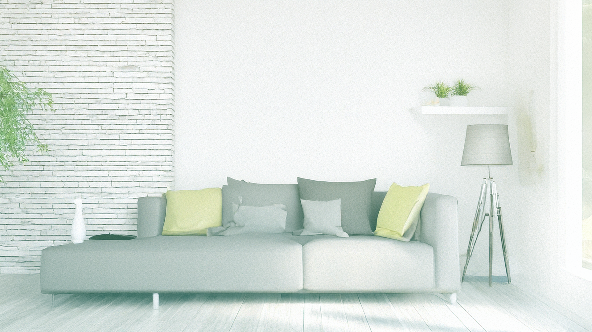

目的：今後 TypeScript や React にスケールする為の準備段階
使用技術： JavaScript/CSS/HTML

このコードは、HTML、CSS、JavaScript を使ってシンプルな画像ギャラリーを実装していますね。それぞれのファイルがどのような役割を担っているか見ていきましょう。

<h1>HTML ファイル (index.html) の解説</h1>
このファイルは、ウェブページの構造を定義しています。

- <!DOCTYPE html>: これは、このドキュメントがHTML5で書かれていることをブラウザに伝えます。

- <html lang="ja">: ドキュメントのルート要素です。lang="ja" は、このページの主要な言語が日本語であることを示しています。

- <head>: ウェブページのメタ情報（ブラウザに表示されない情報）が含まれます。

  - <meta charset="UTF-8" />: 文字エンコーディングを指定し、日本語を含む様々な文字が正しく表示されるようにします。

  - <meta name="viewport" content="width=device-width, initial-scale=1.0" />: レスポンシブデザインのための設定です。デバイスの幅に合わせてページの表示を調整し、初期のズームレベルを1.0に設定します。

  - <title>画像ギャラリーの例</title>: ブラウザのタブやウィンドウのタイトルバーに表示されるページのタイトルです。

  - <link rel="stylesheet" href="style.css" />: style.css という外部のCSSファイルを読み込み、ページのスタイルを適用します。

- <body>: ウェブページに表示されるすべてのコンテンツが含まれます。

  - 
JavaScript画像ギャラリー
: "JavaScript画像ギャラリー"というテキストを含む div 要素です。後述のCSSで特別な装飾が施されます。

  -  : 改行タグを行い、コンテンツを読みやすくします。

  - 
: 画像とボタンをまとめるためのコンテナです。

    - : 画像を表示するための img 要素です。

      - id="galleryImage": JavaScript でこの要素を特定するための ID です。

      - src="Ver2_Stylish_Interior2025.png": 最初（デフォルト）に表示される画像のファイルパスです。

      - alt="ギャラリー画像": 画像が表示されない場合に代替テキストとして表示される説明です。視覚障がい者向けのスクリーンリーダーにも読み上げられます。

    - <button id="nextButton">次の画像</button>: 画像を切り替えるためのボタンです。
      - id="nextButton": JavaScript でこのボタンを特定するための ID です。

  - : script.js という外部のJavaScriptファイルを読み込みます。これにより、画像切り替えの動的な機能がページに追加されます。

  <h1>CSS ファイル (style.css) の解説</h1>
  このファイルは、HTML要素の見た目（色、サイズ、配置など）を定義しています。

<h3>body: </h3>
ページ全体のスタイルを設定します。

<h3>width: </h3>
  
<h3>100%; height: 100vh;: </h3>
  幅をビューポートの 100%、高さをビューポートの高さ全体に設定します。

<h3>background: url(Ver2_Stylish_Interior2025_6.png) no-repeat;: </h3>
背景画像を設定し、繰り返し表示しないようにします。

<h3>background-size: cover;: </h3>
背景画像が要素全体を覆うように拡大・縮小します。

<h3>font-family: Arial, sans-serif;: </h3>
フォントを設定します。

<h3>text-align: center;: </h3>
テキストを中央揃えにします。

<h3>margin-top: 50px;: </h3>
上部に 50 ピクセルの余白を設定します。

<h3>Gallery セクションのスタイル</h3>

<h3>.gallery-container: </h3>
画像とボタンを囲む div のスタイルです。

<h3>border, padding, display, box-shadow, border-radius: </h3>
枠線、余白、表示形式、影、角の丸みを設定し、画像ギャラリーの見た目を整えます。

<h3>#galleryImage: </h3>
ギャラリー画像のスタイルです。

<h3>width: 500px; height: 400px;: </h3>
画像の幅と高さを固定します。

<h3>object-fit: cover;: </h3>
画像の縦横比を維持したまま、指定された幅と高さに収まるように調整します。はみ出る部分は切り取られます。

<h3>margin-bottom: 20px; border: 2px solid #ddd;: </h3>
下部に余白と枠線を設定します。

<h3>#nextButton: </h3>
「次の画像」ボタンのスタイルです。

<h3>padding, font-size, cursor, background-color, color, border, border-radius: </h3>
内側の余白、フォントサイズ、カーソル、背景色、文字色、枠線、角の丸みを設定し、ボタンの見た目を定義します。

<h3>#nextButton:hover: </h3>
ボタンにマウスが乗ったときのスタイルです。

<h3>background-color: #218838;: </h3>
背景色を暗くして、ホバーエフェクト（マウスオーバー時の視覚効果）を提供します。

  <h3>Box セクションのスタイル</h3>

<h3>.box: </h3>
"JavaScript 画像ギャラリー"のテキストを含む div のスタイルです。

<h3>width, height, margin, display, align-items, justify-content: </h3>
ボックスのサイズ、中央配置、テキストの垂直・水平方向の中央揃えを設定します。

<h3>color, font-size, font-weight: </h3>
文字の色、サイズ、太さを設定します。

<h3>position: relative;: </h3>
子要素（::before, ::after）の配置基準となります。

<h3>transition: 0.4s;: </h3>
プロパティが変化する際に 0.4 秒かけてアニメーションするように設定します。

<h3>.box::before, .box::after: </h3>
.box 要素の仮想要素（擬似要素）です。これらは HTML には存在しませんが、CSS で生成され、要素の装飾に使われます。ここでは、ボックスの四隅に装飾的なボーダーを作成しています。

<h3>content: "";: </h3>
仮想要素のコンテンツを空に設定します。

<h3>width: 50px; height: 50px;: </h3>
初期サイズを設定します。

<h3>border-top, border-left, border-bottom, border-right: </h3>
上、左、下、右にボーダーを設定します。

<h3>position: absolute;: </h3>
親要素（.box）に対して絶対的な位置で配置されます。

<h3>top, left, bottom, right: </h3>
それぞれの位置を調整します。

<h3>transition: 0.4s; transition-delay: 0.5s;: </h3>
変化にアニメーション効果を付け、0.5 秒の遅延を設定します。

<h3>.box:hover:before, .box:hover::after: </h3>
.box にマウスが乗ったときに、::before と ::after 仮想要素のスタイルを変更します。

<h3>width: 100%; height: 100%;: </h3>
仮想要素がボックス全体を覆うように拡大します。

<h3>border-color: </h3>
rgba(255, 255, 255, 0.3);: ボーダーの色を変更します。

<h3>transition-delay: 0s;: </h3>
遅延なしでアニメーションが開始されます。

<h3>border-radius: 5px;: </h3>
角を丸くします。

<h3>.box:hover: </h3>
.box にマウスが乗ったときのスタイルです。

<h3>background: </h3>
rgba(255, 255, 255, 0.1);: 背景色を半透明の白にします。

<h3>backdrop-filter: blur(15px);: </h3>
背景にある要素をぼかす効果を適用します。

<h3>transition-delay: 0.3s;: </h3>
0.3 秒の遅延を設定します。

<h3>border-radius: 5px;: </h3>
角を丸くします。

<h1>JavaScript ファイル (script.js) の解説</h1>

このファイルは、ページの動的な振る舞いを制御します。

- const galleryImage = document.getElementById("galleryImage");: HTML 内で id="galleryImage" が設定されている要素（タグ）を取得し、galleryImage という定数に代入します。

- const nextButton = document.getElementById("nextButton");: HTML 内で id="nextButton" が設定されている要素（<button>タグ）を取得し、nextButton という定数に代入します。

- const images = [...]: これは、ギャラリーで表示する画像のファイルパスを格納した配列です。この配列に画像ファイルの名前を追加することで、ギャラリーに表示される画像の種類を増やすことができます。

- let currentIndex = 0;: 現在表示されている画像のインデックス（配列内の位置）を追跡するための変数です。最初は 0（配列の最初の画像）に設定されています。

- nextButton.addEventListener("click", () => { ... });: これは、nextButton がクリックされたときに実行されるイベントリスナーを設定しています。

  - currentIndex = (currentIndex + 1) % images.length;:

    - currentIndex + 1: 現在のインデックスを 1 つ増やします。

    - % images.length: これは「剰余演算子」（または「モジュロ演算子」）です。配列の長さで割った余りを計算します。これにより、currentIndex が配列の最後（images.length - 1）に達したときに、次のクリックで currentIndex が 0 に戻り、最初の画像に戻るループが実現されます。

  - galleryImage.src = images[currentIndex];: galleryImage（要素）の src 属性を、images 配列から現在の currentIndex に対応する画像のパスに変更します。これにより、表示される画像が切り替わります。

- コメントブロック: コードの下にあるコメントは、開発者への注意書きです。画像ファイルが適切に配置されているか、またはテスト用のダミー画像 URL の使用方法について説明しています。

<h1>【まとめ】</h1>
このコードは、シンプルなHTML構造にCSSで見た目を整え、JavaScriptで「次の画像」ボタンをクリックすると画像が順番に切り替わる機能を実装しています。
特に、CSSの .box 要素に適用されているホバー時のアニメーションは、ユーザーインタラクションを向上させる工夫として面白いですね。
